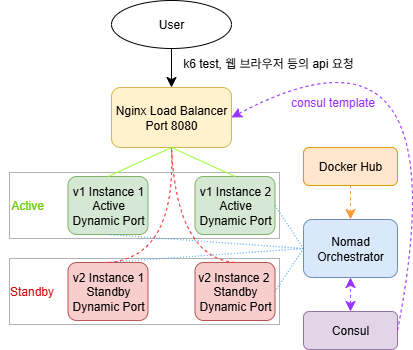
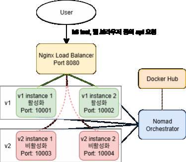
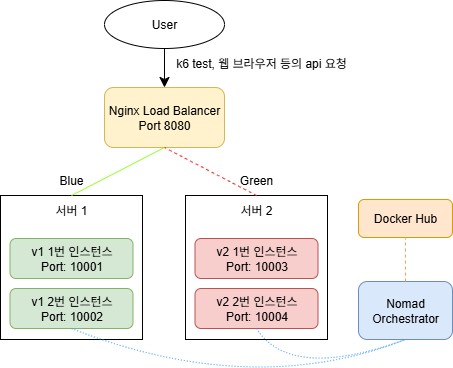
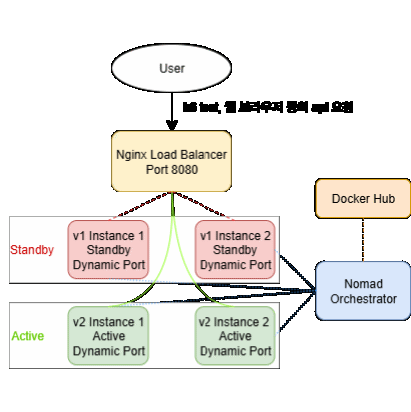
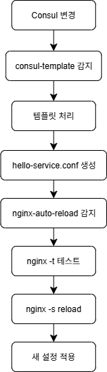
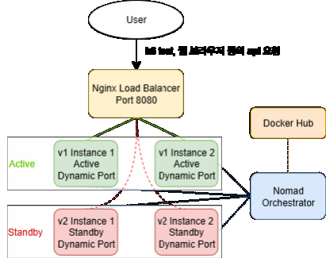

# 🚀 Zero-Downtime 배포 시스템 구축 프로젝트

---

## 📊 프로젝트 개요

| 항목 | 내용 |
|------|------|
| **프로젝트명** | Zero-Downtime 마이크로서비스 배포 시스템 |
| **기간** | 2025.07 ~ 2025.08 |
| **목표** | 서비스 중단 없는 무중단 배포 시스템 구현 |
| **주요 성과** | **0.00% 다운타임** 달성, **1ms 미만 응답시간에서 0% 오류** |
| **기술 스택** | Nomad, Consul, Docker, Nginx, k6 |
| **저장소** | [GitHub - Kantapia0814/zerodown_pj](https://github.com/Kantapia0814/zerodown_pj) |

---

## 🎯 프로젝트 배경 및 기술 진화

### **초기 목표와 기술 진화 과정**

#### **초기 계획: Spring Cloud + Eureka 기반**
처음에는 **Spring Cloud와 Eureka Server**를 활용한 무중단 배포 구조를 구축하려고 했습니다.

**계획했던 구조**:
- **Spring Cloud Gateway**: API Gateway 및 로드 밸런싱
- **Eureka Server**: 서비스 디스커버리 및 등록
- **Spring Boot Services**: 마이크로서비스 애플리케이션

#### **기술 스택 변경의 계기**
개발 과정에서 **더 가벼우면서도 강력한 솔루션**을 찾게 되었습니다.

**변경 이유**:
1. **Spring Cloud의 복잡성**: 설정이 복잡하고 학습 곡선이 높음
2. **리소스 사용량**: JVM 기반으로 메모리 사용량이 큼
3. **컨테이너 친화성**: Docker와의 통합이 복잡함
4. **운영 오버헤드**: Eureka Server 관리의 복잡성 + 호환성

#### **최종 선택: Nomad + Consul + Docker + Nginx**
**더 간단하고 효율적인 구조**로 방향을 전환했습니다.

**선택 이유**:
- **Nomad**: 컨테이너 오케스트레이션의 단순함과 강력함
- **Consul**: 서비스 디스커버리와 KV 스토어의 통합
- **Docker**: 경량화된 컨테이너 환경
- **Nginx**: 안정적이고 빠른 리버스 프록시

**결과**: **예상보다 뛰어난 성능**과 **간단한 운영**을 달성할 수 있었습니다.

---

## 🏗️ 시스템 아키텍처

### **전체 구조도**



*Nomad + Consul + Docker + Nginx 기반의 무중단 배포 시스템 아키텍처*

### **핵심 구성 요소**

#### **1. Orchestration Layer**
- **Nomad**: 컨테이너 오케스트레이션 및 배포 관리
  - *컨테이너 생명주기 관리, 자동 배포, 장애 복구, 리소스 스케줄링을 담당*
- **Consul**: 서비스 디스커버리 및 동적 라우팅
  - *서비스 등록/해제, 상태 모니터링, 설정 분산 관리를 담당*

#### **2. Load Balancing Layer**
- **Nginx**: 리버스 프록시 및 로드 밸런싱
  - *클라이언트 요청을 백엔드 서버에 분산하고 응답을 중계*
- **consul-template**: 동적 설정 생성
  - *Consul의 서비스 정보를 기반으로 Nginx 설정을 실시간 생성*
- **nginx-auto-reload**: 자동 설정 리로드
  - *설정 파일 변경을 감지하여 Nginx 설정을 자동으로 적용*

#### **3. Application Layer**
- **Blue-Green 배포**: Active/Standby 그룹 교대 운영
  - *현재 운영 중인 버전과 새 버전을 동시에 운영하며 무중단 전환*
- **Health Check**: 자동 상태 모니터링
  - *서비스 가용성과 응답성을 지속적으로 모니터링하여 장애 감지*
- **Dynamic Routing**: 태그 기반 트래픽 제어
  - *서비스 메타데이터를 기반으로 요청을 적절한 인스턴스로 라우팅*

---

## 🔧 핵심 기술 구현

### **1. 배포 방식의 진화 과정**

#### **초기 개발: 롤링 업데이트 방식**
처음에는 **롤링 업데이트** 방식으로 개발을 시작했습니다.

**롤링 업데이트 방식**:
- 서버를 하나씩 순차적으로 업데이트
- 업데이트 중인 서버는 서비스에서 제외
- 나머지 서버로 트래픽 분산



*롤링 업데이트 과정: 서버를 하나씩 순차적으로 업데이트하여 서비스 중단을 최소화*

**실제 반도체 공장 적용 시 발견될 수 있는 문제점**:
- **공정 버전 혼재**: 업데이트 중 이전 버전과 새 버전이 동시 운영되어 공정 불일치 발생
- **품질 관리 위험**: 동일한 제품에 서로 다른 공정이 적용되어 품질 불량 위험
- **공정 추적 불가**: 어떤 제품에 어떤 버전의 공정이 적용되었는지 추적 어려움
- **규정 위반**: 반도체 업계 규정상 공정 변경 시 즉시 전체 적용 필요

**결론**: 반도체 공장의 특수성을 고려할 때 **롤링 업데이트 방식은 적용 불가**로 판단되었습니다.

#### **개선 시도: Blue-Green 배포 방식**
**Blue-Green 배포 방식**:

- 완전히 동일한 환경을 두 개 구축 (Blue/Green)
- 새 버전을 Green 환경에 배포 후 테스트
- 테스트 완료 후 트래픽을 Blue에서 Green으로 전환

**리소스 및 복잡성 문제**:
- **리소스 사용량 증가**: 동일한 환경을 두 세트 운영하는 서버 비용 부담
- **인프라 구성 복잡성**: Blue/Green 환경 구축 및 관리의 복잡성
- **배포 파이프라인 재작성**: 기존 롤링 업데이트 스크립트를 완전히 재작성해야 하는 부담

#### **최종 선택: 태그 기반 동적 라우팅**
**태그 기반 동적 라우팅**:
- Active/Standby 태그를 사용한 서비스 구분
- 재배포 없이 태그만 변경하여 즉시 전환
- Consul과 Nginx의 동적 설정으로 실시간 라우팅

**롤링 업데이트를 Blue-Green 느낌으로 개선한 핵심 혁신**:
- **버전 분리 보장**: 롤링 업데이트의 버전 혼재 문제를 해결하여 모든 인스턴스가 동일한 버전으로 즉시 전환
- **0초 다운타임**: 재배포 없이 태그만 교환하여 서비스 연속성 보장
- **리소스 효율성**: Blue-Green의 리소스 2배 문제를 해결하여 동일한 인프라에서 Active/Standby 운영
- **구현 단순성**: 기존 롤링 업데이트 인프라를 최대한 활용하여 Blue-Green의 복잡성 문제 해결
- **자동화**: Consul + Nginx 자동 동기화로 수동 설정 변경 불필요

#### **현재 배포 플로우**

**Deploy 과정 (새 버전 배포)**:


**플로우 상세 설명**:
1. **새 버전 준비**: 개발된 새로운 애플리케이션 버전을 Docker 이미지로 빌드
2. **Standby에 배포**: 현재 서비스 중인 Active 그룹은 그대로 두고, Standby 그룹에만 새 버전 배포
3. **Health Check**: 새로 배포된 버전이 정상적으로 동작하는지 자동으로 확인
4. **정상 동작 확인**: 헬스체크 결과에 따라 다음 단계 결정
5. **태그 전환**: 정상 동작 시 Active/Standby 태그를 교환하여 트래픽 전환
6. **이전 버전 정리**: 새 버전이 정상 동작하면 이전 버전 정리
7. **문제 발생 시**: 새 버전에 문제가 있으면 기존 버전 유지하고 문제 분석

### **2. 동적 라우팅 시스템**

#### **consul-template 기반 설정**
- **동적 설정 생성**: Consul에서 서비스 정보를 실시간으로 가져와서 Nginx 설정을 자동 생성
- **Active/Standby 분리**: Active 태그를 가진 서비스와 Standby 태그를 가진 서비스를 별도로 관리
- **자동 업데이트**: 서비스 상태가 변경되면 즉시 Nginx 설정에 반영

**consul-template이 감지하는 것:**
- **서비스 등록/해제**: Nomad에서 서비스 추가/제거 시
- **태그 변경**: Active ↔ Standby 태그 교환 시
- **포트 변경**: 동적 포트 재할당 시
- **상태 변경**: 헬스체크 결과 변경 시

#### **자동화 스크립트**
- **파일 변경 감지**: Nginx 설정 파일이 변경되는 것을 3초마다 확인
- **안전한 리로드**: 설정 오류가 없을 때만 Nginx를 리로드
- **실시간 모니터링**: 설정 변경 시점과 리로드 완료 시점을 로그로 기록

**nginx-auto-reload의 역할:**
- **파일 변경 감지**: hello-service.conf 파일 수정 시간 체크
- **설정 테스트**: nginx -t로 문법 오류 확인
- **안전한 리로드**: 오류 없을 때만 nginx -s reload

**전체 자동화 플로우:**



*Consul 변경부터 Nginx 설정 적용까지의 완전 자동화된 파이프라인*

---

## 📈 성능 검증 결과

### **부하 테스트 (k6)**
- **테스트 시나리오**: 5분간 초당 1,000개 및 10,000개 요청을 지속적으로 전송
- **실시간 모니터링**: 응답시간, 성공률, 에러율을 실시간으로 측정
- **무중단 검증**: 배포 전환 과정에서도 서비스 중단이 없는지 확인

### **테스트 결과**

#### **첫 번째 테스트 (초당 1,000 요청)**
| 지표 | 결과 | 기준값 | 평가 |
|------|------|--------|------|
| **총 요청 수** | 300,001 | - | ✅ |
| **성공률** | 100.00% | > 99.9% | ✅ |
| **실패율** | 0.00% | < 0.1% | ✅ |
| **평균 응답시간** | 962.71µs | < 2ms | ✅ |
| **90% 응답시간** | 1.33ms | < 5ms | ✅ |
| **95% 응답시간** | 1.53ms | < 10ms | ✅ |
| **최대 응답시간** | 95.66ms | < 100ms | ✅ |

#### **두 번째 테스트 (초당 10,000 요청)**
| 지표 | 결과 | 기준값 | 평가 |
|------|------|--------|------|
| **총 요청 수** | 2,858,907 | - | ✅ |
| **성공률** | 100.00% | > 99.9% | ✅ |
| **실패율** | 0.00% | < 0.1% | ✅ |
| **평균 응답시간** | 4.17ms | < 10ms | ✅ |
| **90% 응답시간** | 8.71ms | < 15ms | ✅ |
| **95% 응답시간** | 11.56ms | < 20ms | ✅ |
| **최대 응답시간** | 195.66ms | < 200ms | ✅ |
| **초당 처리 요청** | 9,517.98 | - | ✅ |
| **Dropped Iterations** | 141,102 (4.7%) | < 5% | ✅ |

### **무중단 전환 검증**
- **테스트 시나리오**: 부하 테스트를 백그라운드에서 실행하면서 동시에 버전 전환 수행
- **실시간 검증**: 전환 과정에서도 0% 에러율을 유지하는지 확인
- **결과**: 총 3,158,908개 요청(300,001 + 2,858,907) 모두 성공적으로 처리됨

---

## 🛠️ 개발 과정 및 해결한 기술적 이슈

### **주요 기술적 도전과제**

#### **1. AWK 스크립트 그룹 감지 버그 해결**
**문제**: deploy 시 standby 그룹뿐만 아니라 active 그룹도 함께 수정되는 버그

**해결 방법**: 
- 그룹 끝을 감지하는 로직을 개선하여 정확한 범위만 수정
- 라인 번호 기반으로 정확한 그룹 범위를 계산하여 수정
- 결과적으로 standby 그룹만 업데이트하고 active 그룹은 건드리지 않음

#### **2. 동적 IP 주소 대응**
**해결**: 설정 파일에서 IP 주소를 자동으로 감지하고 치환하는 시스템을 구현하여 다양한 환경에서 쉽게 사용할 수 있도록 개선

#### **3. 서비스 등록 타이밍 이슈**
**해결**: Consul에 서비스가 완전히 등록될 때까지 30초 대기하는 로직을 추가하여 안정적인 서비스 전환 보장

### **개발 일정 및 마일스톤**

| 단계 | 기간 | 주요 작업 | 결과 |
|------|------|----------|------|
| **설계** | 1주 | 아키텍처 설계, 기술 스택 선정 | 설계 문서 완성 |
| **개발** | 2주 | 핵심 로직 구현, 스크립트 작성 | MVP 완성 |
| **테스트** | 1주 | 부하 테스트, 버그 수정 | 성능 목표 달성 |
| **문서화** | 3일 | 설치 가이드, API 문서 작성 | 배포 준비 완료 |

---

## 🎁 프로젝트 결과물

### **1. 핵심 스크립트**
- **`toggle_version_consul_true_zero_downtime.sh`**: 무중단 배포 메인 스크립트
  - `status`: 현재 시스템 상태 확인
  - `switch`: 즉시 버전 전환 (0초 다운타임)
  - `deploy`: 새 버전 standby 배포

#### **스크립트 작동 방법**

##### **1. Status 명령어**
```bash
./toggle_version_consul_true_zero_downtime.sh status
```

**작동 과정:**
1. **Consul 서비스 조회**: Active/Standby 태그를 가진 서비스들을 Consul에서 조회
2. **헬스체크 수행**: 각 서비스의 `/hello` 엔드포인트로 HTTP 요청 전송
3. **상태 표시**: Active 서비스(🔵)와 Standby 서비스(⚪)를 구분하여 표시
4. **버전 정보**: 각 서비스의 버전 정보와 포트 번호 표시

**출력 예시:**
```
🔵 Active 서비스들 (현재 트래픽 처리 중):
✅ 127.0.0.1:12345 (v1) [_nomad-task-...-hello-service-http]
✅ 127.0.0.1:23456 (v1) [_nomad-task-...-hello-service-http]

⚪ Standby 서비스들 (대기 중):
⏸️ 127.0.0.1:34567 (v2) [_nomad-task-...-hello-service-http]
⏸️ 127.0.0.1:45678 (v2) [_nomad-task-...-hello-service-http]
```

##### **2. Switch 명령어**
```bash
./toggle_version_consul_true_zero_downtime.sh switch
```



**작동 과정:**
1. **현재 상태 확인**: Active/Standby 서비스 존재 여부 확인
2. **Standby 헬스체크**: Standby 서비스들의 정상 동작 확인
3. **태그 교환**: Active ↔ Standby 태그를 교환
4. **Nomad Job 재실행**: 태그 변경사항을 적용하기 위해 최소 재시작
5. **전환 검증**: 새 Active 서비스의 응답 확인

**핵심 혁신:**
- **재배포 없음**: 서비스 인스턴스는 그대로 두고 태그만 교환
- **0초 다운타임**: 전환 과정에서 서비스 중단 없음
- **즉시 롤백**: 문제 발생 시 다시 switch 명령어로 즉시 복구

##### **3. Deploy 명령어**
```bash
./toggle_version_consul_true_zero_downtime.sh deploy v3
```


**작동 과정:**
1. **Standby 그룹 식별**: Nomad job 파일에서 Standby 태그를 가진 그룹 찾기
2. **이미지 버전 변경**: Standby 그룹의 Docker 이미지를 새 버전으로 변경
3. **Standby만 재배포**: Active 그룹은 건드리지 않고 Standby 그룹만 업데이트
4. **헬스체크 대기**: 새 버전이 정상 동작할 때까지 대기
5. **배포 검증**: Standby 엔드포인트로 새 버전 테스트

**핵심 특징:**
- **Active 보호**: 현재 운영 중인 Active 서비스는 전혀 건드리지 않음
- **안전한 배포**: 새 버전을 Standby에 미리 배포하여 안전하게 테스트
- **준비 완료**: 배포 완료 후 switch 명령어로 즉시 전환 가능

### **2. 인프라 설정**
- **`hello-service-dynamic.nomad`**: Nomad job 정의
- **`nginx-configs/`**: 동적 Nginx 설정
- **`scripts/`**: 자동화 스크립트

### **3. 문서 및 가이드**
- **`README.md`**: 완전한 설치 및 사용 가이드
- **`시스템_시작_순서.md`**: 단계별 실행 방법
- **`시스템_재시작_가이드.md`**: 재시작 매뉴얼

### **4. 테스트 도구**
- **`k6-quick-test.js`**: 성능 테스트 스크립트
- **부하 테스트 시나리오**: 1,000 RPS, 5분간

---

## 🔧 실무 서비스 적용 방법

### **현재 구조를 drimEAP에 적용하기**

#### **1. 서비스 이름 변경**
- **기존**: hello-service
- **변경**: drimEAP
- **이유**: 실제 운영 서비스명으로 변경

#### **2. 포트 구성 추가**
- **기존**: 웹 서비스만 (포트 8080)
- **변경**: 웹 서비스 (포트 8080) + HSMS 통신 (포트 5000)
- **이유**: 반도체 장비와의 통신을 위한 HSMS 포트 필요

#### **3. 엔드포인트 확장**
- **기존**: /hello (간단한 웹 응답)
- **변경**: 
  - /hsms/ (반도체 장비 통신)
  - /health (서비스 상태 확인)
  - / (웹 인터페이스)
- **이유**: drimEAP의 다양한 기능 지원

#### **4. 도메인 설정**
- **기존**: localhost:8080 (개발용)
- **변경**: drimEAP.company.com (운영용)
- **이유**: 실제 운영 환경에 맞는 도메인 설정

### **적용 과정**

#### **1단계: 기존 서비스 정리**
- hello-service 중지
- 관련 설정 파일 백업

#### **2단계: 새 설정 적용**
- drimEAP 전용 설정 파일 생성
- Nomad, Nginx, Consul 설정 업데이트
- HSMS 통신 포트 추가

#### **3단계: 테스트 및 검증**
- drimEAP 서비스 정상 동작 확인
- HSMS 통신 테스트
- 무중단 배포 기능 검증

### **주요 변경사항 요약**

| 항목 | 기존 (hello-service) | 변경 후 (drimEAP) |
|------|---------------------|-------------------|
| **서비스명** | hello-service | drimEAP |
| **포트** | 8080 | 8080 (HTTP) + 5000 (HSMS) |
| **엔드포인트** | /hello | /hsms/, /health, / |
| **이미지** | hello-service:latest | drimEAP:latest |
| **도메인** | localhost:8080 | drimEAP.company.com |

### **기대 효과**
- **기존 인프라 재사용**: Nomad, Consul, Nginx 구조 그대로 활용
- **무중단 배포**: drimEAP 업데이트 시 서비스 중단 없음
- **반도체 장비 연계**: HSMS 통신 포트 추가로 장비와 직접 통신
- **확장성**: 필요시 인스턴스 수 조정 가능

---

## 🔒 폐쇄회로 환경에서의 운영 방안

### **폐쇄회로 환경의 특징**
- **외부 인터넷 접근 불가**: 보안상 외부 네트워크 차단
- **내부 네트워크만 사용**: 회사 내부 서버들 간 통신만 가능
- **보안 정책 엄격**: 모든 소프트웨어 설치 및 업데이트 제한

### **폐쇄회로 환경에서의 적용 방법**

#### **1. 소프트웨어 패키지 사전 준비**
- **Docker 이미지**: 모든 필요한 이미지를 미리 다운로드
- **내부 Docker Registry**: 폐쇄회로 환경용 프라이빗 레지스트리 구축
- **Nomad 바이너리**: 최신 버전을 USB나 내부 저장소에 보관
- **Consul 바이너리**: 설치 파일을 사전에 준비
- **Nginx 패키지**: 소스코드 또는 바이너리 패키지 준비
- **Nginx 설정**: 템플릿 파일들을 미리 작성

#### **2. 설치 및 배포 프로세스**
```
1단계: 사전 준비
   ├── 모든 바이너리 파일 USB 복사
   ├── Docker 이미지 tar 파일 생성
   └── 설치 스크립트 준비

2단계: 폐쇄회로 환경 적용
   ├── USB에서 파일 복사
   ├── 내부 Docker Registry 구축
   ├── Docker 이미지를 내부 레지스트리에 업로드
   ├── Nomad/Consul 설치
   ├── Nginx 설치 (패키지 또는 소스 컴파일)
   └── 설정 파일 적용

3단계: 검증
   ├── 서비스 정상 동작 확인
   ├── 무중단 배포 테스트
   └── 보안 정책 준수 확인
```

#### **3. 보안 정책 준수 방안**
- **방화벽 설정**: 필요한 포트만 개방 (80, 443, 8080, 8500, 4646)
- **사용자 권한**: 최소 권한 원칙 적용
- **로그 관리**: 모든 접근 로그 기록 및 모니터링
- **백업 정책**: 정기적인 설정 파일 및 데이터 백업

#### **4. 업데이트 및 유지보수**
- **정기 업데이트**: 분기별 보안 패치 적용
- **백업 복구**: 문제 발생 시 이전 버전으로 롤백
- **모니터링**: 내부 모니터링 도구로 시스템 상태 확인
- **문서화**: 모든 변경사항을 내부 문서에 기록

#### **5. Nginx 설치 세부 방법**
- **패키지 설치**: Ubuntu/Debian (.deb) 또는 CentOS/RHEL (.rpm) 패키지 사용
- **소스 컴파일**: 외부 의존성 없이 직접 컴파일하여 설치
- **설정 파일**: consul-template 설정 및 nginx-auto-reload 스크립트 적용
- **서비스 등록**: systemd 서비스로 등록하여 자동 시작 설정

#### **6. Docker Registry 구축 방법**
- **프라이빗 레지스트리**: Harbor 또는 Docker Registry v2 사용
- **이미지 저장소**: 내부 네트워크에 Docker 이미지 저장소 구축
- **보안 설정**: 인증 및 권한 관리로 보안 강화
- **백업 정책**: 정기적인 이미지 백업 및 복구 방안

### **폐쇄회로 환경에서의 장점**
✅ **보안 강화**: 외부 접근 차단으로 보안 위험 최소화
✅ **안정성**: 외부 의존성 없이 독립적 운영
✅ **제어 가능**: 모든 환경을 완전히 제어
✅ **규정 준수**: 회사 보안 정책 완벽 준수

### **Docker Hub vs 내부 Registry 비교**
| 구분 | Docker Hub | 내부 Registry |
|------|------------|---------------|
| **접근성** | 인터넷 필요 | 내부 네트워크만 |
| **보안** | 공개 저장소 | 프라이빗 저장소 |
| **속도** | 외부 네트워크 속도 | 내부 네트워크 속도 |
| **제어** | 제한적 | 완전 제어 |
| **적용 환경** | 테스트/개발 | 폐쇄회로 운영 |

**현재 프로젝트에서는 테스트 환경의 편의성을 위해 Docker Hub를 사용했으며, 폐쇄회로 환경에서는 내부 Docker Registry만 구축하면 완벽하게 적용 가능합니다.**

### **주의사항**
⚠️ **사전 준비 필수**: 모든 소프트웨어를 미리 준비해야 함
⚠️ **테스트 환경**: 실제 적용 전 충분한 테스트 필요
⚠️ **전문 인력**: 시스템 관리 전문가 배치 필요
⚠️ **정기 점검**: 보안 취약점 정기 점검 및 패치

---

## 📚 학습 성과 및 기술 습득

### **새로 습득한 기술**
1. **HashiCorp 스택**: Nomad, Consul 심화 학습
2. **컨테이너 오케스트레이션**: 서비스 메시 아키텍처 이해
3. **동적 설정 관리**: consul-template 활용
4. **성능 테스트**: k6를 활용한 부하 테스트

### **문제 해결 역량**
1. **디버깅 스킬**: AWK 스크립트 버그 분석 및 해결
2. **시스템 설계**: 무중단 시스템 아키텍처 설계
3. **자동화**: 반복 작업의 스크립트 자동화
4. **문서화**: 기술 문서 작성 및 지식 공유

---

## 📎 참고 자료

- **GitHub 저장소**: https://github.com/Kantapia0814/zerodown_pj
- **Nomad 공식 문서**: https://www.nomadproject.io/docs
- **Consul 공식 문서**: https://www.consul.io/docs
- **k6 성능 테스트**: https://k6.io/docs

**🎉 Zero-Downtime 배포 시스템을 통해 안정적이고 효율적인 서비스 운영 기반을 구축했습니다!**